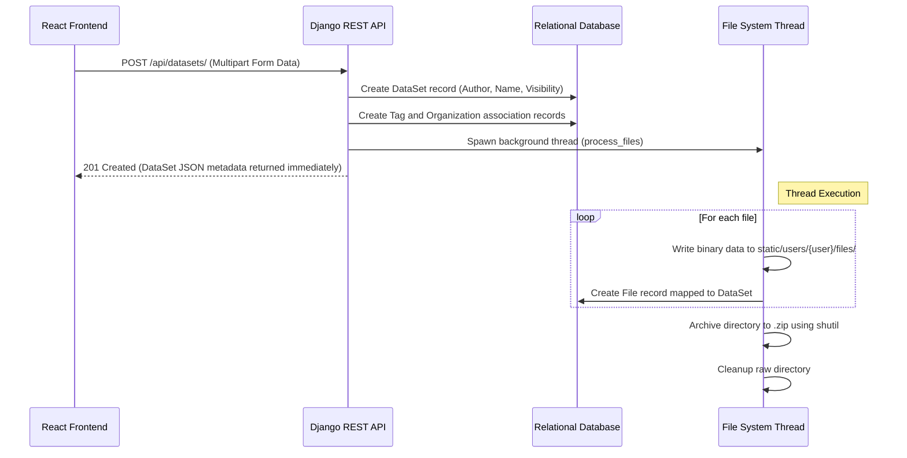
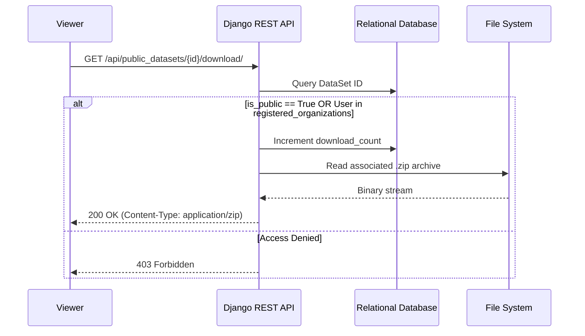

## 5. V1 — Baseline Platform Branch: main, commit: e36879a

### 5.1 DataDock as the Starting Point
The development of V1 did not begin from scratch; rather, it was built upon an existing codebase from a published research project, DataDock (cited in our literature review under arXiv:2406.16880). DataDock was selected as the foundational baseline for several strategic reasons: its comprehensive initial feature coverage aligned closely with our project goals, its technology stack matched our development expertise, and its open-source license permitted flexible adaptation.

Before building upon this foundation, we conducted a thorough analysis of the application's architecture to understand how its various components were connected. The platform operates on a decoupled architecture, with a React frontend communicating asynchronously with a Django backend via a REST API. Understanding this data flow was critical to identifying what needed to be adapted and establishing the exact steps required to ensure the application compiled, built, and ran seamlessly in our specific deployment environment.

### 5.2 Tech Stack

The selected baseline utilized a robust, modern technology stack tailored for rapid prototyping and global state management:

| Component | Choice | Rationale |
| :--- | :--- | :--- |
| **Backend** | Django + DRF | Rapid development, built-in ORM and auth |
| **Authentication** | Knox Token | Stateless, per-token revocation |
| **Frontend** | React + Redux | SPA, global state management |
| **Database** | SQLite | Zero-config, sufficient for prototype |
| **Static files** | WhiteNoise | No separate web server needed |

### 5.3 Core Feature Overview

By successfully building the baseline codebase, V1 immediately inherited a suite of core capabilities.

1.  **Authentication & Authorization:**
    *   Secure user registration and login.
    *   Role-based access control (Admin, Researcher, Viewer).
2.  **Data Upload & Management:**
    *   Capability for Researchers to upload datasets using a drag-and-drop interface.
    *   Association of datasets with metadata (tags, descriptions).
    *   Grouping of datasets into manageable folders.
3.  **Secure File Access & Collaboration (Organizations):**
    *   Granular privacy controls (public vs. private datasets).
    *   Integration with an `Organization` model to share datasets securely within registered groups.
    *   Secure download mechanism for packaged dataset archives (.zip).
4.  **Social/Review System:**
    *   Capability for users to review datasets, leave comments, and rate them.
    *   Notification system to alert authors when their datasets are reviewed or downloaded.

#### API & Endpoint Design

The application uses a comprehensive RESTful API architecture. Core workflows are separated into intuitive API resources managed by Django ViewSets.

### Data Management API

| Endpoint | Method | Description | Access |
| :--- | :--- | :--- | :--- |
| `/api/datasets/` | `GET` | List all datasets owned by the authenticated user. | Authenticated |
| `/api/datasets/` | `POST` | Upload a new dataset (handles multipart/form-data). | Authenticated |
| `/api/datasets/{id}/` | `GET`, `PATCH`, `DELETE` | Retrieve, update, or delete a specific dataset. | Owner/Admin |
| `/api/public_datasets/` | `GET` | Browse publicly unlocked datasets. | Open / Viewer |
| `/api/public_datasets/{id}/download/` | `GET` | Securely download the packaged dataset zip archive. | Open / Viewer |
| `/api/folder/` | `GET`, `POST`, `PATCH` | Manage folders grouping datasets. | Authenticated |
| `/api/tags/` | `POST` | Create metadata tags associated with datasets. | Authenticated |

### Social and Organization API

| Endpoint | Method | Description | Access |
| :--- | :--- | :--- | :--- |
| `/api/organizations/` | `GET` | List organizations the user is a part of. | Authenticated |
| `/api/reviews/` | `GET`, `POST` | Fetch reviews or post a new review on a dataset. | Authenticated |
| `/api/notifications_review/`| `GET` | Retrieve notifications regarding reviews. | Authenticated |
| `/api/conversations/` | `GET`, `POST` | Start or fetch direct messaging conversations. | Authenticated |

### Workflow Diagrams

#### Data Upload & Processing Flow
This diagram illustrates the asynchronous file handling process upon dataset upload.



#### Secure Download Flow
This diagram shows how public and organizational data access is handled.



---

#### Code Implementation: Core Snippets

The following snippets highlight the critical logic implementing the DataDock architecture, spanning database schema definition, complex API request handling, and frontend state management.

##### Backend Models: DataSet and Organization structure
The `models.py` defines the core data structure. Notice the `ManyToManyField` for organizations and the helper methods for locating the physical files on disk.

```python
# delta_web/delta/data/models.py
from django.db import models
from django.contrib.auth import get_user_model
from organizations.models import Organization
from django.utils import timezone

User = get_user_model()

class DataSet(models.Model):
    author = models.ForeignKey(User, related_name="datasets", on_delete=models.CASCADE, null=True)
    folder = models.ForeignKey('Folder', related_name='datasets', on_delete=models.SET_NULL, null=True, blank=True)
    
    is_public = models.BooleanField(default=False)
    is_public_orgs = models.BooleanField(default=False)
    download_count = models.IntegerField(default=0)
    timestamp = models.DateTimeField(default=timezone.now)

    description = models.TextField(blank=True, default="")
    # Secure sharing mechanism
    registered_organizations = models.ManyToManyField(Organization, blank=True, related_name="uploaded_datasets")

    name = models.CharField(max_length=128)
    original_name = models.CharField(max_length=128)

    def get_zip_path(self):
        return f'static/users/{self.author}/files/{self.original_name}.zip'

class File(models.Model):
    dataset = models.ForeignKey(DataSet, related_name="files", on_delete=models.CASCADE, null=True)
    file_path = models.TextField(db_column='file_path', blank=True, null=True, unique=True)
    file_name = models.TextField(db_column="file_name", blank=False, null=False, unique=False)
```

##### API Logic: Asynchronous File Processing
To prevent UI freezing during large data uploads, the Django viewset processes metadata synchronously and delegates I/O bound file operations to a background thread.

```python
# delta_web/delta/data/api.py
from rest_framework import viewsets, permissions
from rest_framework.response import Response
from rest_framework.parsers import MultiPartParser
import threading, os, shutil

class ViewsetDataSet(viewsets.ModelViewSet):
    queryset = DataSet.objects.all()
    permission_classes = [permissions.IsAuthenticated]
    parser_classes = (MultiPartParser,)

    def create(self, request):
        author = self.request.user
        name = request.data.get('name')
        
        # 1. Create directory structure
        strDataSetPath = f'static/users/{author.username}/files/{name}'
        os.makedirs(strDataSetPath, exist_ok=True)

        # 2. Save metadata to DB
        dataSet = DataSet(
            author=author, 
            is_public=request.data.get("is_public") == "true",
            name=name, 
            original_name=name
        )
        dataSet.save()

        # 3. Extract file data from request
        fileDatas = []
        num_files = sum(1 for k in request.data.keys() if k.endswith('relativePath'))
        
        for index in range(num_files):
            file_key = f"file.{index}"
            full_path = os.path.join(strDataSetPath, request.data[file_key + '.relativePath'])
            file_obj = request.data[file_key]
            
            File(dataset=dataSet, file_path=full_path, file_name=str(file_obj)).save()
            fileDatas.append({'file_path': full_path, 'file_data': file_obj.read()})

        # 4. Process files asynchronously
        thread = threading.Thread(
            target=process_files, 
            args=(fileDatas, strDataSetPath, dataSet.get_zip_path())
        )
        thread.start()

        return Response(self.get_serializer(dataSet).data)

def process_files(file_data_list, dataset_path, dataset_zip_path):
    # Concurrent file writing omitted for brevity...
    # Archive the directory once writing is complete
    shutil.make_archive(base_name=dataset_zip_path[:-4], format='zip', root_dir=dataset_path)
    shutil.rmtree(dataset_path)
```

##### Frontend: React Redux Actions
The React frontend uses Axios to interface with the backend API, utilizing Redux actions to maintain a predictable state.

```javascript
// delta_web/delta/frontend/src/actions/datasets.js
import axios from 'axios';
import { createMessage } from "./messages";
import { fileTokenConfig, tokenConfig } from './auth';
import { ADD_DATASET, GET_DATASETS_PUBLIC } from "./types";

// Upload Dataset Action
export const addDataset = (dictData) => (dispatch, getState) => {
    // Uses fileTokenConfig to set Content-Type to multipart/form-data
    return axios.post('/api/datasets/', dictData, fileTokenConfig(getState))
    .then((res) => {
        dispatch(createMessage({ addDatasetSuccess: "File Uploaded Successfully" }));
        dispatch({ type: ADD_DATASET, payload: res.data });
        return res;
    })
    .catch((err) => {
        console.error("Upload Error:", err);
    });
};

// Fetch Public Datasets Action
export const getPublicDatasets = () => (dispatch) => {
    axios.get('/api/public_datasets/')
    .then(res => {
        dispatch({ type: GET_DATASETS_PUBLIC, payload: res.data });
    })
    .catch(err => console.error(err));
};
```

##### Frontend: Data Upload UI Component
The `DataUploadForm` utilizes `react-dropzone` to provide a modern drag-and-drop interface.

```javascript
// delta_web/delta/frontend/src/components/data_transfer/DataUploadForm.js
import React, { useState } from 'react';
import { useDropzone } from 'react-dropzone';
import { connect } from 'react-redux';
import { addDataset } from '../../actions/datasets';
import styled from 'styled-components';

const DropContainer = styled.div`
  border: 2px dashed ${props => (props.isDragActive ? '#00e676' : '#000000')};
  padding: 20px;
  background-color: #f8f9fa;
  text-align: center;
  cursor: pointer;
`;

const DataUploadForm = ({ addDataset, auth }) => {
  const { getRootProps, getInputProps, isDragActive, acceptedFiles } = useDropzone();

  const onSubmit = (e) => {
    e.preventDefault();
    const formData = new FormData();
    formData.append('name', "MyNewDataset");
    formData.append('is_public', true);
    
    acceptedFiles.forEach((file, index) => {
      formData.append(`file.${index}`, file);
      formData.append(`file.${index}.relativePath`, file.path);
    });

    addDataset(formData);
  };

  return (
    <form onSubmit={onSubmit}>
      <DropContainer {...getRootProps({ isDragActive })}>
        <input {...getInputProps()} />
        {isDragActive ? <p>Drop files here...</p> : <p>Drag and drop files, or click to select</p>}
      </DropContainer>
      <button type="submit" className="btn btn-primary mt-3">Upload Dataset</button>
    </form>
  );
};

export default connect(mapStateToProps, { addDataset })(DataUploadForm);
```

### 5.4 Linux Server Hosting and Network Configurations

Once the architectural dependencies were mapped and the build process was stabilized, the next step was deploying V1 to a remote Linux server for collaborative testing. To ensure the submission scripts executed properly and the required directories were accessible, `+WantGPUHomeMounted = true` was added to all environment configurations.

During this phase, we encountered significant networking limitations. By design, the baseline development server was configured to bind exclusively to the local loopback interface (`127.0.0.1` / `localhost`). As a result, while the application ran flawlessly on the server itself, it remained entirely invisible and inaccessible from external network requests.

To bypass this hardcoded restriction without restructuring the underlying security configurations for a simple prototype test, we utilized `ngrok`. By implementing port forwarding via `ngrok`, we successfully established a secure HTTP tunnel, exposing the locally hosted server to the public internet and allowing our team and initial testers to access the platform remotely.

### 5.5 Limitations of V1 — Motivating the First Evaluation Round

While the DataDock baseline provided a massive head start, V1 as a forked platform had easily identifiable functional gaps tailored strictly to its original context. For our specific use case, these limitations included:
* **Insufficient Organization Permissions:** The permission granularity was too coarse to handle complex, real-world laboratory hierarchies.
* **No Data Preview:** Users had to download datasets entirely just to view their contents, causing massive friction in the research workflow.
* **Coarse File Management:** The system lacked nuanced tools for managing files dynamically once they were uploaded.

These exact limitations underscore the necessity of our methodology. With V1 successfully running and remotely accessible via our Linux/ngrok setup, the immediate next step is to formally transition into the evaluation phase. We now need to observe how actual users interact with the platform to confirm these hypotheses, identify unforeseen friction points, and prioritize the development backlog for V2.
