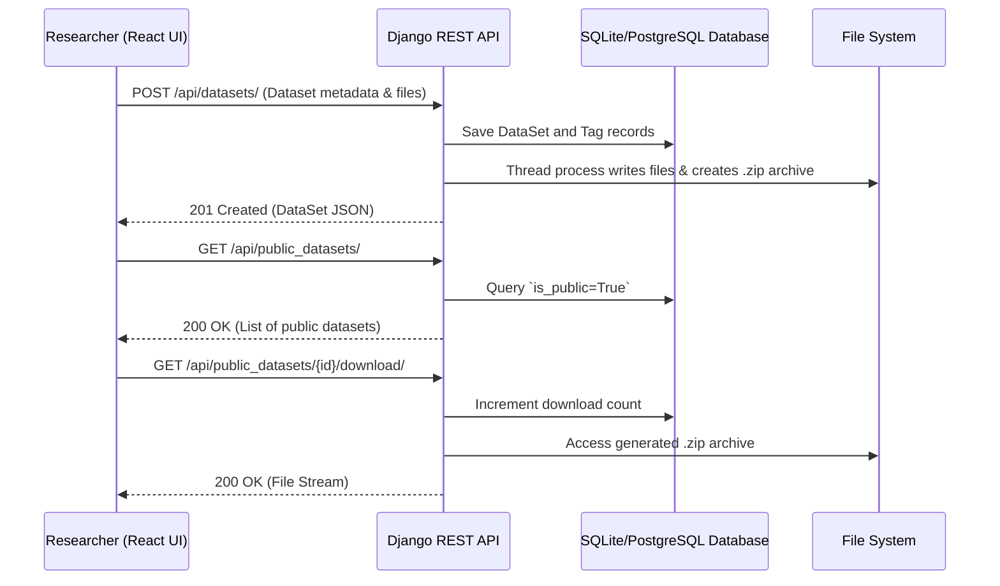

# 5. Iteration 1: MVP Implementation (~10 Pages)

## 5.1 Agile Methodology: Sprint structure and MVP definition

The Minimum Viable Product (MVP) development will follow an Agile Methodology to ensure iterative, flexible, and responsive implementation of the core features. The project will be structured into **three-week sprints**. This duration allows adequate time for design, implementation, testing, and review within each cycle without extending the feedback loop unnecessarily.

### MVP Definition
The MVP focuses on the core workflows necessary for a Data Management Platform tailored for Drug Discovery Research:
- **Authentication & Authorization**: Role-based access control (Admin, Researcher, Viewer) handling registration and login functionality.
- **Data Upload & Management**: Capability for Researchers to upload datasets, associate them with metadata (such as drug names and tags), and group them into folders.
- **Secure File Access & Transfer**: The ability for users to browse, search, and download public datasets or datasets shared securely via an organization or private access.
- **Basic Social/Review System**: Preliminary capability for researchers to review or comment on data sets to gauge quality and validity.

### Sprint Breakdown Example
- **Sprint 1: Foundation and Authentication**
  - Setup core repository, database schema (SQLite mapping to standard relational models), and web framework (Django + React).
  - Implement secure user authentication and define role-based access control.
- **Sprint 2: Data Management**
  - Implement models and REST endpoints for Dataset, File, Folder, and Tags.
  - Build UI for data upload and dataset structuring.
- **Sprint 3: Access Control & Deployment**
  - Implement file privacy (locked vs. unlocked state) and organization-based access control.
  - Finalize React frontend integrations.
  - Testing, debugging, and initial deployment.

---

## 5.2 Tech Stack Justification: Languages, frameworks, and cloud providers chosen

While the initial system specification suggested a NoSQL database (MongoDB) due to its flexible schema, the actual implemented tech stack relies on a robust relational architecture for stability, structure, and mature ecosystem integrations.

### 1. Backend: Python & Django REST Framework
- **Why Django?** Django provides an out-of-the-box, secure admin interface and robust Object-Relational Mapping (ORM) capabilities. It accelerates development for data-heavy applications, natively handles robust authentication, and manages complex relational data efficiently.
- **Why REST Framework?** The Django REST Framework (DRF) is highly scalable and easily serializes complex dataset models to interact seamlessly with the frontend.

### 2. Frontend: JavaScript & React.js
- **Why React?** React allows for the creation of dynamic, Single Page Applications (SPAs). This provides researchers with a fast, seamless browsing experience when viewing large amounts of data, filtering studies, and navigating complex folder structures without full-page reloads.

### 3. Database: SQLite (Development) / PostgreSQL (Production)
- **Deviation from Spec:** The initial specification recommended MongoDB. However, relational databases are better suited for the heavily interconnected data models of this system (e.g., Users, Roles, Organizations, Datasets, Reviews, Folders). The system utilizes SQLite for development and seamless transitioning to PostgreSQL for production. PostgreSQL handles complex queries and high concurrency better than typical NoSQL solutions for structured metadata and user associations.

---

## 5.3 API & Endpoint Design: REST/GraphQL structure for the core workflows

The application uses a RESTful API architecture. Core workflows are separated into intuitive API resources managed by Django ViewSets.

### Key Endpoints

| Endpoint | Method | Description | Access |
| :--- | :--- | :--- | :--- |
| `/api/datasets/` | `GET`, `POST` | List all user-accessible datasets, or upload a new dataset. | Authenticated |
| `/api/datasets/{id}/` | `GET`, `PATCH`, `DELETE` | Retrieve, update, or delete a specific dataset. | Owner/Admin |
| `/api/public_datasets/` | `GET` | Browse publicly unlocked datasets. | Open / Viewer |
| `/api/public_datasets/{id}/download/` | `GET` | Securely download the packaged dataset zip file. | Open / Viewer |
| `/api/folder/` | `GET`, `POST` | Create or manage folders grouping datasets. | Authenticated |
| `/api/tags/` | `GET`, `POST` | Create tags associated with datasets. | Authenticated |

### API Workflow Diagram



---

## 5.4 MVP Code Implementation: Core snippets

The initial backend logic effectively integrates database management with secure file handling and processing. Below are core code snippets from the actual implementation demonstrating how the backend processes multi-part file uploads and securely structures data.

### Database Models: Structured Data & File Organization
The `DataSet` model links directly to an author and tracks organizations and visibility.

```python
class DataSet(models.Model):
    author = models.ForeignKey(User, related_name="datasets", on_delete=models.CASCADE, null=True)
    folder = models.ForeignKey(Folder, related_name='datasets', on_delete=models.SET_NULL, null=True, blank=True)

    is_public = models.BooleanField(default=False)
    is_public_orgs = models.BooleanField(default=False)
    download_count = models.IntegerField(default=0)
    timestamp = models.DateTimeField(default=timezone.now)

    description = models.TextField(blank=True, default="")
    registered_organizations = models.ManyToManyField(Organization, blank=True, related_name="uploaded_datasets")

    name = models.CharField(max_length=128)
    original_name = models.CharField(max_length=128)

    def get_zip_path(self):
        return f'static/users/{self.author}/files/{self.original_name}.zip'
```

### Backend Logic: Secure Data Upload and Zipping Workflow
When a user uploads a dataset, the application concurrently saves the metadata into the database and processes the actual files in a separate thread to prevent blocking the REST API response.

```python
class ViewsetDataSet(viewsets.ModelViewSet):
    queryset = DataSet.objects.all()
    permission_classes = [permissions.IsAuthenticated]
    serializer_class = SerializerDataSet
    parser_classes = (MultiPartParser,)

    def create(self, request):
        author = self.request.user
        name = self.request.data.get('name')
        is_public = self.request.data.get("is_public") == "true"

        # User file path definition
        strUserFilePath = f'static/users/{request.user.username}/files'
        strDataSetPath = os.path.join(strUserFilePath, name)
        os.makedirs(strDataSetPath, exist_ok=True)

        # Create dataset metadata
        dataSet = DataSet(author=author, is_public=is_public, name=name, original_name=name)
        dataSet.save()

        # Gather files from multipart request
        fileDatas = []
        num_files = sum(1 for k in request.data.keys() if k.endswith('relativePath'))

        for index in range(0, num_files):
            file_key = f"file.{index}"
            relative_path = request.data[file_key + '.relativePath']
            full_path = os.path.join(strDataSetPath, relative_path)
            file_obj = request.data[file_key]

            # Save file database record
            File(dataset=dataSet, file_path=full_path, file_name=str(file_obj)).save()

            fileDatas.append({
                'file_path': full_path,
                'file_data': file_obj.read()
            })

        # Start a new thread to write files and create zip archive
        thread = threading.Thread(target=process_files, args=(fileDatas, strDataSetPath, dataSet.get_zip_path()))
        thread.start()

        return Response(self.get_serializer(dataSet).data)

def process_files(file_data_list, dataset_path, dataset_zip_path):
    threads = []
    # Write files concurrently
    for file_obj in file_data_list:
        thread = threading.Thread(target=write_file, args=(file_obj['file_path'], file_obj['file_data']))
        thread.start()
        threads.append(thread)

    for thread in threads:
        thread.join()

    # Zip the files securely
    shutil.make_archive(base_name=dataset_zip_path[:-4], format='zip', root_dir=dataset_path)
    shutil.rmtree(dataset_path)
```
