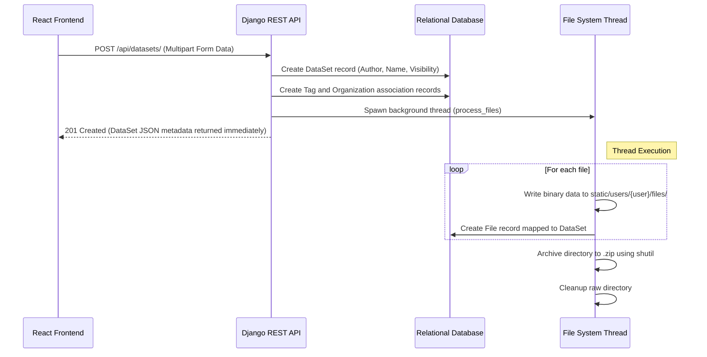
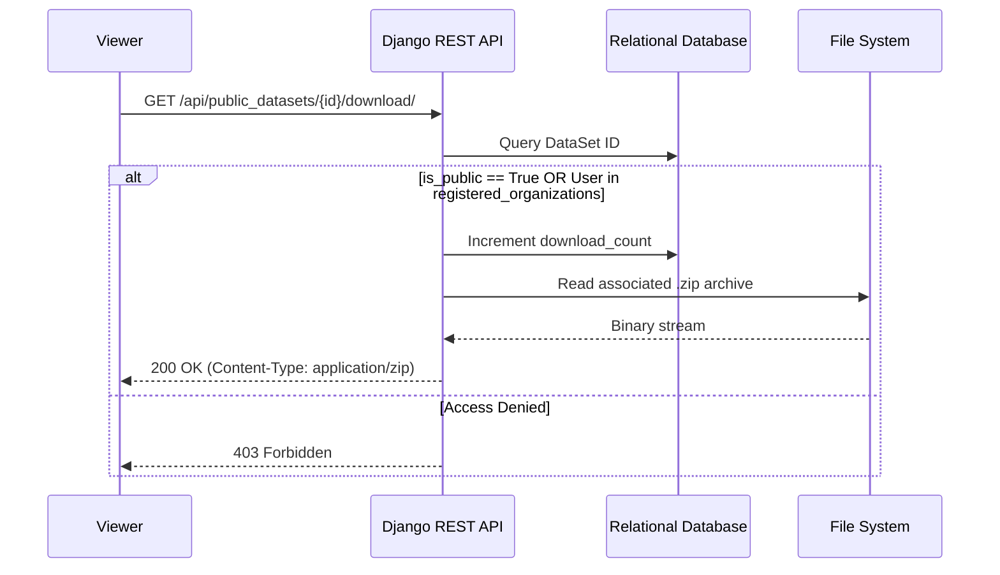

# 5. Iteration 1: MVP Implementation

This section details the implementation of the Minimum Viable Product (MVP) for the DataDock Platform (formerly Delta). It covers the methodology, technology stack, API endpoints, and core code implementations.

## 5.1 Agile Methodology: Sprint Structure and MVP Definition

The development of the MVP was governed by an Agile Scrum methodology. This approach ensures an iterative, flexible, and responsive implementation process, allowing the team to adapt to new requirements and user feedback continuously.

### Sprint Structure
The project was structured into **three-week sprints**. This duration was chosen to balance the need for rapid iteration with the time required to develop complex backend data processing features and frontend UI components.

* **Sprint Planning:** At the start of each sprint, the product owner and development team define the sprint goal and select user stories from the product backlog.
* **Daily Stand-ups:** Brief daily meetings to synchronize activities, discuss progress, and identify any blockers.
* **Sprint Review:** At the end of the sprint, the team demonstrates the completed features to stakeholders.
* **Sprint Retrospective:** The team reflects on the sprint process to identify improvements for the next cycle.

### MVP Definition and Scope
The MVP focuses on the core workflows necessary for a secure Data Management Platform tailored for Drug Discovery Research. The essential features include:

1.  **Authentication & Authorization:**
    *   Secure user registration and login.
    *   Role-based access control (Admin, Researcher, Viewer).
2.  **Data Upload & Management:**
    *   Capability for Researchers to upload datasets using a drag-and-drop interface.
    *   Association of datasets with metadata (tags, descriptions).
    *   Grouping of datasets into manageable folders.
3.  **Secure File Access & Collaboration (Organizations):**
    *   Granular privacy controls (public vs. private datasets).
    *   Integration with an `Organization` model to share datasets securely within registered groups.
    *   Secure download mechanism for packaged dataset archives (.zip).
4.  **Social/Review System:**
    *   Capability for users to review datasets, leave comments, and rate them.
    *   Notification system to alert authors when their datasets are reviewed or downloaded.

### Sprint Breakdown
*   **Sprint 1: Foundation and Authentication**
    *   Set up the core repository and environment.
    *   Design the database schema mapping to standard relational models.
    *   Configure the web framework (Django + React).
    *   Implement user authentication and define basic models (`User`, `Organization`).
*   **Sprint 2: Data Management and Storage**
    *   Implement Django models and REST endpoints for `DataSet`, `File`, `Folder`, and `TagDataset`.
    *   Develop the threaded backend process for handling multi-part file uploads and `.zip` archiving.
    *   Build the React frontend UI for the data upload form (`DataUploadForm.js`).
*   **Sprint 3: Social Features and Refinement**
    *   Implement the `Review`, `Conversation`, and `Notification` models.
    *   Develop the frontend interfaces for searching, browsing, and downloading datasets.
    *   Establish Redux state management for frontend data flows.
    *   Comprehensive testing (Jest for frontend, Django Test Framework for backend) and initial deployment.

---

## 5.2 Tech Stack Justification

While the initial system specification suggested a NoSQL database (MongoDB) due to its flexible schema, the actual implemented tech stack relies on a robust relational architecture combined with a modern JavaScript frontend.

### 1. Backend: Python & Django
*   **Framework Choice:** Django was selected over micro-frameworks like Flask due to its "batteries-included" philosophy. It provides an out-of-the-box admin interface, robust Object-Relational Mapping (ORM), and built-in security features against common vulnerabilities (SQL injection, XSS, CSRF).
*   **REST Architecture:** The Django REST Framework (DRF) is utilized to expose backend models as RESTful APIs. DRF's `ModelViewSet` and robust serialization make it highly efficient for serving complex, nested JSON data to the frontend.

### 2. Frontend: JavaScript, React.js, and Redux
*   **UI Library:** React allows for the creation of dynamic, Single Page Applications (SPAs). This provides researchers with a fast, seamless browsing experience. Complex UIs, like the drag-and-drop file uploader, are easily managed through React's component-based architecture.
*   **State Management:** Redux (via `react-redux` and `@reduxjs/toolkit`) is used to manage the global application state. This is crucial for handling asynchronous actions like file uploads, user authentication tokens, and maintaining the shopping cart state for dataset downloads.
*   **Build Tools:** Webpack and Babel are configured to bundle the React application and transpile modern JavaScript, outputting the static assets directly to Django's static files directory.

### 3. Database: SQLite (Development) / PostgreSQL (Production)
*   **Deviation from Specification:** The initial specification recommended MongoDB. However, analysis of the required features revealed highly interconnected data entities. For example, a `Review` links a `User` to a `DataSet`, which in turn belongs to a `Folder` and is associated with multiple `Organizations` and `Tags`.
*   **Relational Advantage:** Relational databases (RDBMS) are inherently better suited for this heavily interconnected structure, ensuring data integrity through foreign keys and ACID compliance. The system utilizes SQLite for local development simplicity and is designed to seamlessly transition to PostgreSQL for production to handle complex queries and concurrent transactions efficiently.

### 4. Testing Frameworks
*   **Backend:** The standard Django testing framework is employed for unit testing views, models, and API endpoints.
*   **Frontend:** Jest and React Testing Library are utilized for behavioral testing of React components, ensuring UI reliability.

---

## 5.3 API & Endpoint Design

The application uses a comprehensive RESTful API architecture. Core workflows are separated into intuitive API resources managed by Django ViewSets.

### Data Management API

| Endpoint | Method | Description | Access |
| :--- | :--- | :--- | :--- |
| `/api/datasets/` | `GET` | List all datasets owned by the authenticated user. | Authenticated |
| `/api/datasets/` | `POST` | Upload a new dataset (handles multipart/form-data). | Authenticated |
| `/api/datasets/{id}/` | `GET`, `PATCH`, `DELETE` | Retrieve, update, or delete a specific dataset. | Owner/Admin |
| `/api/public_datasets/` | `GET` | Browse publicly unlocked datasets. | Open / Viewer |
| `/api/public_datasets/{id}/download/` | `GET` | Securely download the packaged dataset zip archive. | Open / Viewer |
| `/api/folder/` | `GET`, `POST`, `PATCH` | Manage folders grouping datasets. | Authenticated |
| `/api/tags/` | `POST` | Create metadata tags associated with datasets. | Authenticated |

### Social and Organization API

| Endpoint | Method | Description | Access |
| :--- | :--- | :--- | :--- |
| `/api/organizations/` | `GET` | List organizations the user is a part of. | Authenticated |
| `/api/reviews/` | `GET`, `POST` | Fetch reviews or post a new review on a dataset. | Authenticated |
| `/api/notifications_review/`| `GET` | Retrieve notifications regarding reviews. | Authenticated |
| `/api/conversations/` | `GET`, `POST` | Start or fetch direct messaging conversations. | Authenticated |

### Workflow Diagrams

#### Data Upload & Processing Flow
This diagram illustrates the asynchronous file handling process upon dataset upload.



#### Secure Download Flow
This diagram shows how public and organizational data access is handled.



---

## 5.4 MVP Code Implementation: Core Snippets

The following snippets highlight the critical logic implementing the DataDock architecture, spanning database schema definition, complex API request handling, and frontend state management.

### 5.4.1 Backend Models: DataSet and Organization structure
The `models.py` defines the core data structure. Notice the `ManyToManyField` for organizations and the helper methods for locating the physical files on disk.

```python
# delta_web/delta/data/models.py
from django.db import models
from django.contrib.auth import get_user_model
from organizations.models import Organization
from django.utils import timezone

User = get_user_model()

class DataSet(models.Model):
    author = models.ForeignKey(User, related_name="datasets", on_delete=models.CASCADE, null=True)
    folder = models.ForeignKey('Folder', related_name='datasets', on_delete=models.SET_NULL, null=True, blank=True)

    is_public = models.BooleanField(default=False)
    is_public_orgs = models.BooleanField(default=False)
    download_count = models.IntegerField(default=0)
    timestamp = models.DateTimeField(default=timezone.now)

    description = models.TextField(blank=True, default="")
    # Secure sharing mechanism
    registered_organizations = models.ManyToManyField(Organization, blank=True, related_name="uploaded_datasets")

    name = models.CharField(max_length=128)
    original_name = models.CharField(max_length=128)

    def get_zip_path(self):
        return f'static/users/{self.author}/files/{self.original_name}.zip'

class File(models.Model):
    dataset = models.ForeignKey(DataSet, related_name="files", on_delete=models.CASCADE, null=True)
    file_path = models.TextField(db_column='file_path', blank=True, null=True, unique=True)
    file_name = models.TextField(db_column="file_name", blank=False, null=False, unique=False)
```

### 5.4.2 API Logic: Asynchronous File Processing
To prevent UI freezing during large data uploads, the Django viewset processes metadata synchronously and delegates I/O bound file operations to a background thread.

```python
# delta_web/delta/data/api.py
from rest_framework import viewsets, permissions
from rest_framework.response import Response
from rest_framework.parsers import MultiPartParser
import threading, os, shutil

class ViewsetDataSet(viewsets.ModelViewSet):
    queryset = DataSet.objects.all()
    permission_classes = [permissions.IsAuthenticated]
    parser_classes = (MultiPartParser,)

    def create(self, request):
        author = self.request.user
        name = request.data.get('name')

        # 1. Create directory structure
        strDataSetPath = f'static/users/{author.username}/files/{name}'
        os.makedirs(strDataSetPath, exist_ok=True)

        # 2. Save metadata to DB
        dataSet = DataSet(
            author=author,
            is_public=request.data.get("is_public") == "true",
            name=name,
            original_name=name
        )
        dataSet.save()

        # 3. Extract file data from request
        fileDatas = []
        num_files = sum(1 for k in request.data.keys() if k.endswith('relativePath'))

        for index in range(num_files):
            file_key = f"file.{index}"
            full_path = os.path.join(strDataSetPath, request.data[file_key + '.relativePath'])
            file_obj = request.data[file_key]

            File(dataset=dataSet, file_path=full_path, file_name=str(file_obj)).save()
            fileDatas.append({'file_path': full_path, 'file_data': file_obj.read()})

        # 4. Process files asynchronously
        thread = threading.Thread(
            target=process_files,
            args=(fileDatas, strDataSetPath, dataSet.get_zip_path())
        )
        thread.start()

        return Response(self.get_serializer(dataSet).data)

def process_files(file_data_list, dataset_path, dataset_zip_path):
    # Concurrent file writing omitted for brevity...
    # Archive the directory once writing is complete
    shutil.make_archive(base_name=dataset_zip_path[:-4], format='zip', root_dir=dataset_path)
    shutil.rmtree(dataset_path)
```

### 5.4.3 Frontend: React Redux Actions
The React frontend uses Axios to interface with the backend API, utilizing Redux actions to maintain a predictable state.

```javascript
// delta_web/delta/frontend/src/actions/datasets.js
import axios from 'axios';
import { createMessage } from "./messages";
import { fileTokenConfig, tokenConfig } from './auth';
import { ADD_DATASET, GET_DATASETS_PUBLIC } from "./types";

// Upload Dataset Action
export const addDataset = (dictData) => (dispatch, getState) => {
    // Uses fileTokenConfig to set Content-Type to multipart/form-data
    return axios.post('/api/datasets/', dictData, fileTokenConfig(getState))
    .then((res) => {
        dispatch(createMessage({ addDatasetSuccess: "File Uploaded Successfully" }));
        dispatch({ type: ADD_DATASET, payload: res.data });
        return res;
    })
    .catch((err) => {
        console.error("Upload Error:", err);
    });
};

// Fetch Public Datasets Action
export const getPublicDatasets = () => (dispatch) => {
    axios.get('/api/public_datasets/')
    .then(res => {
        dispatch({ type: GET_DATASETS_PUBLIC, payload: res.data });
    })
    .catch(err => console.error(err));
};
```

### 5.4.4 Frontend: Data Upload UI Component
The `DataUploadForm` utilizes `react-dropzone` to provide a modern drag-and-drop interface.

```javascript
// delta_web/delta/frontend/src/components/data_transfer/DataUploadForm.js
import React, { useState } from 'react';
import { useDropzone } from 'react-dropzone';
import { connect } from 'react-redux';
import { addDataset } from '../../actions/datasets';
import styled from 'styled-components';

const DropContainer = styled.div`
  border: 2px dashed ${props => (props.isDragActive ? '#00e676' : '#000000')};
  padding: 20px;
  background-color: #f8f9fa;
  text-align: center;
  cursor: pointer;
`;

const DataUploadForm = ({ addDataset, auth }) => {
  const { getRootProps, getInputProps, isDragActive, acceptedFiles } = useDropzone();

  const onSubmit = (e) => {
    e.preventDefault();
    const formData = new FormData();
    formData.append('name', "MyNewDataset");
    formData.append('is_public', true);

    acceptedFiles.forEach((file, index) => {
      formData.append(`file.${index}`, file);
      formData.append(`file.${index}.relativePath`, file.path);
    });

    addDataset(formData);
  };

  return (
    <form onSubmit={onSubmit}>
      <DropContainer {...getRootProps({ isDragActive })}>
        <input {...getInputProps()} />
        {isDragActive ? <p>Drop files here...</p> : <p>Drag and drop files, or click to select</p>}
      </DropContainer>
      <button type="submit" className="btn btn-primary mt-3">Upload Dataset</button>
    </form>
  );
};

export default connect(mapStateToProps, { addDataset })(DataUploadForm);
```
