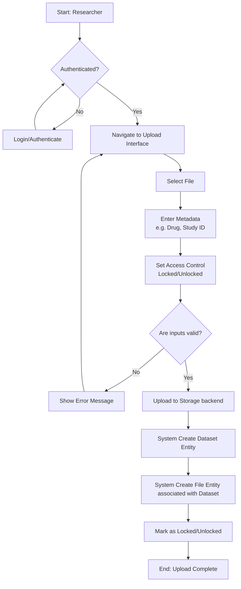
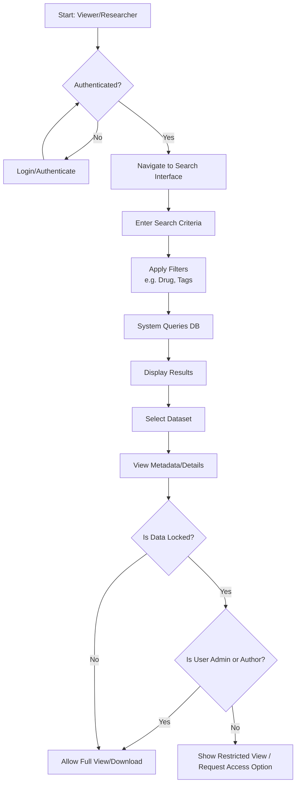
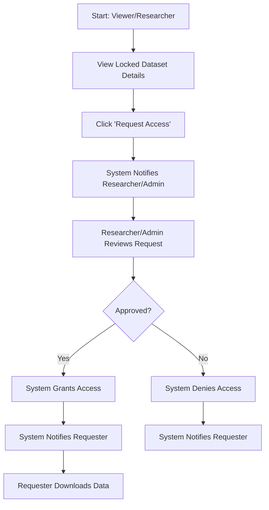
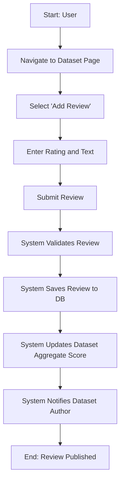
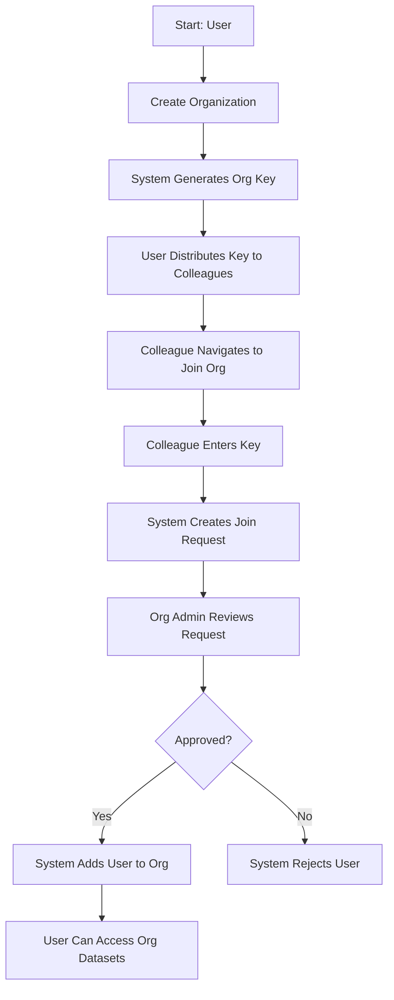

# 3. Requirements and Workflows

This section outlines the target workflows and functional requirements for the Data Management Platform for Drug Discovery Research (DataDock). It is built upon the initial specifications, combined with existing capabilities provided by the application. The system operates as a file transfer system with social media and market-like aspects, specifically designed for researchers and data scientists.

## 3.1 Target Workflows

The following visual flowcharts depict the core data tasks of the system. Each workflow involves specific actors and discrete state changes within the application environment.

### 3.1.1 Secure Upload

This workflow describes the process for researchers to securely upload datasets to the platform.
*   **Actors:** Researcher
*   **Trigger:** The researcher wants to contribute a new dataset (Excel, image, PDF, text) to the platform.
*   **Process Detail:** The system first authenticates the user. Once verified, the user is presented with an upload interface. Here, they select the target files and are required to input comprehensive metadata. This metadata is crucial for the subsequent indexing and discovery of the dataset. The user also sets the access controls (locked vs. unlocked). The system validates the inputs, ensuring all mandatory fields are populated, before securely writing the data to the storage backend and creating corresponding `DataSet` and `File` entities in the database.

### 3.1.2 Dataset Query

This workflow demonstrates how users can browse and query datasets available on the platform.
*   **Actors:** Viewer, Researcher, Admin
*   **Trigger:** A user needs to find specific data for their research.
*   **Process Detail:** After authentication, the user accesses the search interface. They can utilize keyword searches or apply faceted filters (by drug, study, project, tag). The system queries the database and presents a paginated list of results. When a user selects a dataset, the system performs an authorization check. If the data is unlocked, or if the user is the author/admin, full access is granted. Otherwise, only a restricted view of the metadata is presented, along with an option to request access.

### 3.1.3 Data Download Request

This workflow outlines the process of requesting access to download locked datasets.
*   **Actors:** Viewer/Researcher (Requester), Researcher (Author), Admin
*   **Trigger:** A user encounters a locked dataset they need for their work.
*   **Process Detail:** The requester clicks the 'Request Access' button on the dataset detail page. This triggers an internal notification system. The author of the dataset (or an administrator) receives a notification outlining the request. They can then review the requester's profile and intended use. Based on this review, they approve or deny the request. The system updates the access control lists accordingly and notifies the requester of the decision. If approved, a download link or access grant is provided.

### 3.1.4 Data Review and Rating

This workflow highlights the social validation aspect of the DataDock system, where users can assess the validity of datasets.
*   **Actors:** Researcher, Viewer
*   **Trigger:** A user wants to provide feedback on a dataset they have used or reviewed.
*   **Process Detail:** The user navigates to the specific dataset page and selects the review option. They can provide a rating (e.g., 1-5 stars) and write a detailed review post. The system saves this review and updates the aggregate rating for the dataset. The author of the dataset receives a notification of the new review.

### 3.1.5 Organization Management

This workflow describes how users can group together into organizations to share data more efficiently.
*   **Actors:** Admin, Researcher
*   **Trigger:** A group of researchers wants to create a private sharing group.
*   **Process Detail:** A user creates an Organization, becoming its administrator. They can then generate an invite link or key. Other users can request to join the organization using this key. The organization admin approves the join requests. Once members are added, datasets can be uploaded and explicitly linked to the organization, granting all members access.

## 3.2 Functional Requirements

This section provides an Agile backlog of must-have system actions based on user roles and core platform features, incorporating the full suite of DataDock features.

### Epic 1: Authentication and Authorization
*   **Story 1.1:** As an Admin, I want to be able to manage user roles and permissions, so that I can control who has access to different features.
    *   **Acceptance Criteria:** Admin dashboard must show a list of all users. Admin can select a user and change their role from a dropdown. Changes must reflect immediately in the database and the user's session.
*   **Story 1.2:** As an Admin, I want to approve or reject role upgrade requests from Viewers, so that I can elevate their privileges when necessary.
    *   **Acceptance Criteria:** A dedicated queue for upgrade requests must be visible to Admins. Admins can click "Approve" or "Reject". The requesting user receives a notification of the decision.
*   **Story 1.3:** As a User, I want to be able to log in using an email and password, so that I can securely access the platform.
    *   **Acceptance Criteria:** Login page exists. Unsuccessful attempts show a generic error message. Successful attempts redirect to the main dashboard.
*   **Story 1.4:** As a User, I want to view my current role and permissions clearly on the dashboard, so that I know what actions I am authorized to perform.
    *   **Acceptance Criteria:** The user profile menu displays the current role badge (e.g., "Researcher", "Viewer"). UI elements for restricted actions are hidden or disabled if the user lacks permissions.

### Epic 2: Data Management (Upload & Edit)
*   **Story 2.1:** As a Researcher, I want to upload files (Excel templates, images, PDFs, text files), so that I can share my research data.
    *   **Acceptance Criteria:** Upload interface supports drag-and-drop. System accepts valid file extensions and sizes. An upload progress bar is displayed.
*   **Story 2.2:** As a Researcher, I want to provide metadata (e.g., drug name, study ID, descriptions) when uploading a dataset, so that it can be easily discovered by others.
    *   **Acceptance Criteria:** Form fields for standard metadata are required before upload can begin. Users can add custom tags.
*   **Story 2.3:** As a Researcher, I want to organize my datasets into folders, so that I can group related data together.
    *   **Acceptance Criteria:** Users can create a new folder entity. During dataset upload, users can select an existing folder to nest the data.
*   **Story 2.4:** As a Researcher, I want to edit metadata for datasets I have uploaded, so that I can keep information up-to-date.
    *   **Acceptance Criteria:** An "Edit" button is available on the dataset detail page for the author. Modified metadata is saved and search indexes are updated.
*   **Story 2.5:** As an Admin, I want to be able to delete any data within the system, so that I can remove inappropriate or erroneous uploads.
    *   **Acceptance Criteria:** Admins see a "Delete" button on all datasets. Deletion removes the file from storage and the record from the database, cascading to associated reviews.

### Epic 3: Access Control and Organization Management
*   **Story 3.1:** As a Researcher, I want to set the lock status (locked or unlocked) of my uploaded datasets, so that I can control whether others can view/download the full data.
    *   **Acceptance Criteria:** A toggle switch on the upload and edit forms allows setting the lock status. Unlocked datasets offer an immediate download button to all authenticated users.
*   **Story 3.2:** As a Viewer, I want to submit a request to the dataset author or an Admin to download locked data, so that I can gain access to restricted information for my research.
    *   **Acceptance Criteria:** Locked datasets display a "Request Access" button instead of download. Submitting the request opens a dialog for justification text.
*   **Story 3.3:** As a Researcher, I want to create an organization and generate an invite key, so that I can build a private working group.
    *   **Acceptance Criteria:** Users can define an Organization name and description. The system generates a unique, copyable alphanumeric key.
*   **Story 3.4:** As a Researcher, I want to be able to add my dataset to a specific organization, so that other members of that organization can access it.
    *   **Acceptance Criteria:** When editing a dataset, an author can select from a list of organizations they belong to. Once selected, members of that organization bypass "locked" restrictions for that dataset.

### Epic 4: Data Discovery (Search & Filter)
*   **Story 4.1:** As a User, I want to browse available datasets using a tab-based or list-based interface, so that I can quickly scan for relevant information.
    *   **Acceptance Criteria:** The main data page displays datasets in a paginated list view showing title, author, and date.
*   **Story 4.2:** As a User, I want to search for datasets using keywords, so that I can find specific data quickly.
    *   **Acceptance Criteria:** A persistent search bar queries dataset titles, descriptions, and tag texts.

### Epic 5: Social Features and Notifications
*   **Story 5.1:** As a User, I want to leave a review and rating on a dataset, so that I can validate its usefulness for the community.
    *   **Acceptance Criteria:** The dataset page contains a review section. Users can submit a 1-5 star rating and text commentary. The overall dataset rating is aggregated and displayed.
*   **Story 5.2:** As a User, I want to start a conversation regarding a specific topic, so that I can collaborate with other researchers.
    *   **Acceptance Criteria:** Users can create discussion threads. Other users can reply to these threads forming a conversational UI.
*   **Story 5.3:** As a User, I want to receive notifications, so that I know when someone requests my data, reviews my dataset, or replies to my conversation.
    *   **Acceptance Criteria:** A notification bell icon displays unread counts. Clicking it opens a dropdown of chronologically sorted notification items with direct links to the relevant action (e.g., the access request to approve).

### Epic 6: Cart System
*   **Story 6.1:** As a User, I want to add multiple datasets to a cart, so that I can download them all at once later.
    *   **Acceptance Criteria:** Datasets have an "Add to Cart" button. The cart counter increments. The cart page allows reviewing selected datasets and initiating a bulk download.

## 3.3 Others

This section covers additional considerations that are important for the long-term success and scalability of the Data Management Platform, including architecture, non-functional requirements, and future roadmap items.

### 3.3.1 System Architecture Overview
The DataDock platform utilizes a modern, decoupled web architecture:
*   **Frontend (Client-Side):** The user interface is built using React. It is responsible for rendering the UI components, managing local state, and handling user interactions (such as drag-and-drop file uploads). The React application is built using Webpack and served as static files.
*   **Backend (Server-Side):** The core business logic and API endpoints are handled by a Django REST Framework (Python) application. It handles authentication, data validation, authorization checks, and interactions with the database and file system.
*   **Database layer:** Currently, relational mapping is handled via Django models (e.g., SQLite for local development, migrating to PostgreSQL for production). The system models distinct entities for `DataSet`, `File`, `User`, `Organization`, and social entities like `Review` and `Conversation`.
*   **Static Asset Delivery:** Django utilizes WhiteNoise to efficiently serve the compiled static React assets in production, removing the need for a separate frontend node server.

### 3.3.2 Non-Functional Requirements (NFRs)
These define system attributes such as performance, security, and usability.

*   **Security:**
    *   **Data at Rest:** All sensitive user data and credentials must be encrypted in the database.
    *   **Data in Transit:** All client-server communications must occur over HTTPS (TLS 1.2+).
    *   **Access Control Validation:** Every API request accessing a file must independently verify the user's session and role against the requested dataset's lock status and organization affiliations.
*   **Performance:**
    *   **Upload Handling:** The system should support uploading files up to 2GB in size without causing server timeouts, utilizing chunked uploads if necessary.
    *   **Query Response Time:** Standard dataset metadata queries should return within 500ms under expected concurrent load.
*   **Usability:**
    *   **Accessibility:** The UI should comply with basic WCAG 2.1 AA standards, ensuring forms and navigation are usable with screen readers.
    *   **Responsiveness:** The layout must adapt gracefully to desktop, tablet, and mobile device viewports.

### 3.3.3 Future Considerations
*   **Integration of AI-driven analysis tools:** The system architecture and data storage should be designed to facilitate future integration with machine learning pipelines. This includes ensuring data is stored with well-structured metadata and easily retrievable formats.
*   **Advanced Search and Filtering:** As the volume of data grows, implementing more sophisticated search capabilities (e.g., Elasticsearch), such as full-text search, faceted navigation, and semantic search based on drug/study metadata, will be necessary.
*   **Audit Logs:** Implement comprehensive audit logging for all critical system actions. This should include tracking who accessed what data, when it was accessed, and any modifications made. This is crucial for compliance and security in clinical research environments.
*   **External Database Integration:** Plan for API integrations with external research databases (e.g., public drug repositories, genomic databases) to enrich the platform's metadata and allow cross-referencing of information seamlessly within the UI.
*   **Versioning and Edit History:** Implement a robust, Git-like versioning system for datasets, allowing researchers to track changes over time and revert to previous versions if necessary, ensuring data provenance is never lost.

## 5. V1 — Baseline Platform

### 5.1 DataDock as the Starting Point
DataDock is not merely an abstract conceptual application; it is the specific published codebase (arXiv:2406.16880) identified during the literature review as a highly suitable foundation. During the initial analysis phase, a comprehensive audit of the repository was conducted. This involved analyzing how the React frontend seamlessly integrated with the Django backend—specifically noting the architectural choice of serving compiled React static assets directly through Django rather than running a distinct Node.js server in production. The audit mapped out the necessary steps to transition DataDock from a static research artifact into a functional, running platform, ensuring all dependencies (`pipenv`, `npm`) were managed and the local environment accurately mirrored the intended deployment state.

### 5.2 Tech Stack
The baseline system leverages a robust, modern technology stack:
*   **Backend:** Django REST Framework (Python 3.10)
*   **Frontend:** React (JavaScript, bundled via Webpack)
*   **Database:** SQLite (for rapid local prototyping and baseline deployment)
*   **Asset Management:** WhiteNoise (for serving static frontend files through Django)

This specific stack was selected because it aligns perfectly with the goals of rapid prototyping and agile development. Django's "batteries-included" philosophy provided immediate out-of-the-box solutions for user authentication and ORM mapping, while React allowed for a dynamic, responsive user interface. Using SQLite eliminated database provisioning overhead during the initial V1 deployment, accelerating the time to a testable artifact.

### 5.3 Core Feature Overview
The V1 baseline encompasses several core features that interconnect to form the foundation of the data management platform.
*   **Authentication & User Management:** Secure login and registration.
*   **Dataset CRUD Operations:** Researchers can securely upload, read, update metadata for, and delete datasets.
*   **Visibility Permissions:** Fine-grained control over dataset visibility (locked vs. unlocked state).
*   **Batch Downloads (Cart):** The ability to queue multiple datasets for bulk downloading.
*   **Social Validation:** Rating and reviewing datasets via threads and comments.

Through the lens of the initial system analysis, these features act cohesively: a user authenticates, navigates the React UI to upload data via an API, the Django backend creates the necessary database records, and WhiteNoise serves the updated UI to other users who can then discover and request that data based on the established visibility permissions.

### 5.4 Hosting and Server Configuration
To transition the system from local development to a testable environment, V1 was deployed on a Linux server. A critical deployment challenge encountered was network configuration: by default design, the Django development server was binding only to the local loopback address (`127.0.0.1` or `localhost`), making the application completely inaccessible externally to stakeholders.

To diagnose and resolve this issue rapidly without complex DNS or reverse-proxy setups (like Nginx/Apache) for the V1 prototype, a secure tunneling solution was implemented using **ngrok**. By running ngrok and forwarding the local port (e.g., `8000`), the application was successfully exposed to the internet via a secure, temporary HTTPS URL, allowing for immediate external access and testing.

### 5.5 Limitations of V1 — Motivating the First Evaluation Round
While V1 successfully establishes the baseline platform, the initial audit identified several critical gaps:
*   **Insufficient Organization Permission Granularity:** While organizations exist, the permission models within them are overly simplistic and lack nuanced roles (e.g., distinguishing between an organization 'viewer' and 'contributor').
*   **Lack of Data Previews:** Users cannot preview file contents (like CSV columns or image thumbnails) before requesting access or downloading, leading to inefficient discovery.
*   **Coarse File Management:** The folder structures and metadata tagging are relatively basic and may struggle to scale with massive, complex datasets.

These specific gaps make it imperative to move beyond theoretical analysis and gather real-world user feedback to prioritize future development. V1 is running, securely hosted via ngrok—now we need to hear from the users.
