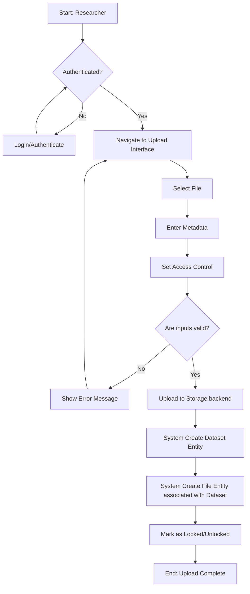
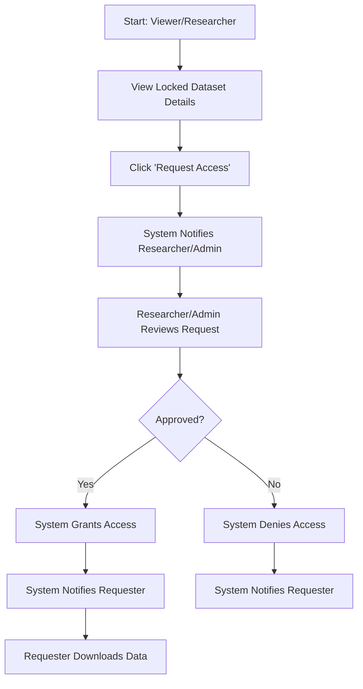

# 3. Requirements and Workflows

This section outlines the target workflows and functional requirements for the Data Management Platform for Drug Discovery Research. It is built upon the initial specifications, combined with existing capabilities provided by the application.

## 3.1 Target Workflows

The following visual flowcharts depict the core data tasks of the system.

### 3.1.1 Secure Upload

This workflow describes the process for researchers to securely upload datasets to the platform.

### 3.1.2 Dataset Query

This workflow demonstrates how users can browse and query datasets available on the platform.

### 3.1.3 Data Download Request

This workflow outlines the process of requesting access to download locked datasets.

## 3.2 Functional Requirements

This section provides an Agile backlog of must-have system actions based on user roles and core platform features.

### Epic 1: Authentication and Authorization
*   **As an Admin**, I want to be able to manage user roles and permissions, so that I can control who has access to different features.
*   **As an Admin**, I want to approve or reject role upgrade requests from Viewers, so that I can elevate their privileges when necessary.
*   **As a User**, I want to be able to log in using an email and password, so that I can securely access the platform.
*   **As a User**, I want to view my current role and permissions clearly on the dashboard, so that I know what actions I am authorized to perform.

### Epic 2: Data Management (Upload & Edit)
*   **As a Researcher**, I want to upload files (Excel templates, images, PDFs, text files), so that I can share my research data.
*   **As a Researcher**, I want to provide metadata (e.g., drug name, study ID, descriptions) when uploading a dataset, so that it can be easily discovered by others.
*   **As a Researcher**, I want to organize my datasets into folders, so that I can group related data together.
*   **As a Researcher**, I want to edit metadata for datasets I have uploaded, so that I can keep information up-to-date.
*   **As an Admin**, I want to be able to delete any data within the system, so that I can remove inappropriate or erroneous uploads.

### Epic 3: Access Control and Collaboration
*   **As a Researcher**, I want to set the lock status (locked or unlocked) of my uploaded datasets, so that I can control whether others can view/download the full data.
*   **As a Viewer**, I want to see clearly marked indicators for locked and unlocked data, so that I know what datasets are immediately accessible.
*   **As a Viewer**, I want to submit a request to the dataset author or an Admin to download locked data, so that I can gain access to restricted information for my research.
*   **As a Researcher**, I want to be able to add my dataset to a specific organization, so that other members of that organization can access it.

### Epic 4: Data Discovery (Search & Filter)
*   **As a User**, I want to browse available datasets using a tab-based or list-based interface, so that I can quickly scan for relevant information.
*   **As a User**, I want to filter datasets by attributes such as drug, study, project, or dataset type, so that I can narrow down my search results.
*   **As a User**, I want to search for datasets using keywords, so that I can find specific data quickly.

## 3.3 Others

This section covers additional considerations that are important for the long-term success and scalability of the Data Management Platform.

### Future Considerations
*   **Integration of AI-driven analysis tools:** The system architecture and data storage (MongoDB or equivalent document store for flexibility) should be designed to facilitate future integration with machine learning pipelines. This includes ensuring data is stored with well-structured metadata and easily retrievable formats.
*   **Advanced Search and Filtering:** As the volume of data grows, implementing more sophisticated search capabilities, such as full-text search, faceted navigation, and semantic search based on drug/study metadata, will be necessary.
*   **Audit Logs:** Implement comprehensive audit logging for all critical system actions. This should include tracking who accessed what data, when it was accessed, and any modifications made. This is crucial for compliance and security in research environments.
*   **External Database Integration:** Plan for API integrations with external research databases (e.g., public drug repositories, genomic databases) to enrich the platform's metadata and allow cross-referencing of information.
*   **Versioning and Edit History:** Implement a robust versioning system for datasets, allowing researchers to track changes over time and revert to previous versions if necessary.
